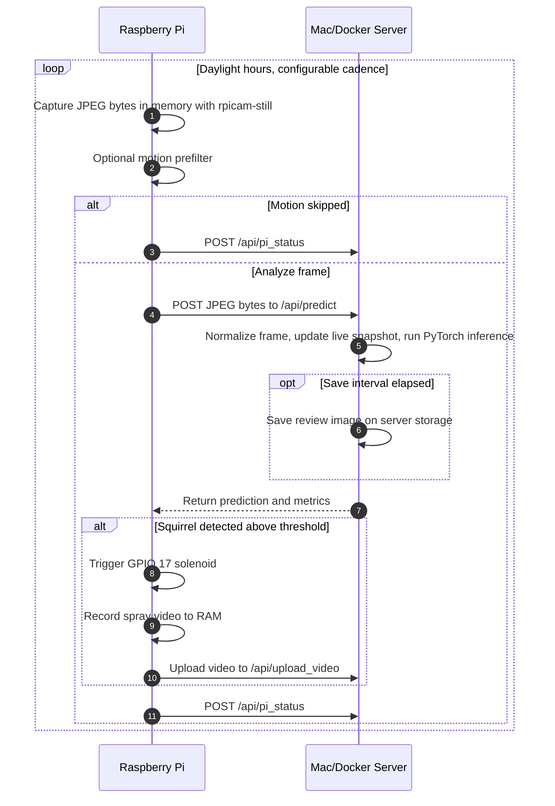

# Squirrel Soaker 9001

The **Squirrel Soaker 9001** is an automated, AI-powered garden protection system that detects squirrels at a birdfeeder and gently repels them with a short blast from a water solenoid valve.

The system is split across two machines:

1. **Raspberry Pi 3/4** with a camera module. It captures still images, reports Pi health, triggers the solenoid locally, and records spray videos.
2. **Mac server or Docker host** running the Flask web app and PyTorch classifier. It receives images over HTTP, runs inference, saves review frames, exposes the dashboard, and stores the training dataset.

The current capture path uses HTTP still-image uploads. RTSP streaming was removed because the still capture path gives better image quality for classification.

---

## Architecture Flow



Normal operation keeps Pi media in memory:

- Still images are captured through `rpicam-still --output -` on current Raspberry Pi OS, with fallback support for legacy `raspistill`, and posted directly to the Mac.
- Unsaved analysis frames are dropped after inference.
- Review frames are saved on the Mac, not the Pi.
- Pi SD-card writes are used only as a backlog fallback when the Mac cannot accept a saved review frame.
- Spray videos record to `/dev/shm/squirrel_soaker` first and move to the Pi SD backlog only if upload fails.

---

## Hardware Requirements

1. Raspberry Pi 3 or 4 running Raspberry Pi OS.
2. Raspberry Pi Camera Module configured with the legacy camera stack.
3. 12V normally closed solenoid valve.
4. Relay module or transistor circuit so Pi GPIO 17 can control the 12V solenoid.
5. 12V DC power supply for the solenoid valve.
6. Tubing and nozzle mounted near the birdfeeder.

---

## Server Setup

The server runs `classify_images.py`, a Flask app that provides:

- `/api/predict` for image inference.
- `/api/pi_status` and `/api/health/history` for system telemetry.
- `/api/settings` for dynamic Pi camera and automation settings.
- `/api/upload_video` for spray event videos.
- A web UI for live monitoring, image review, video review, training, settings, and calibration.

### Option A: Local Mac Server

Use this path for local development or Apple Silicon training.

```bash
python3 -m venv .venv
source .venv/bin/activate
pip install -r requirements.txt
pip install torch torchvision
python classify_images.py
```

To train the classifier, put images in:

- `data/dataset/squirrel/`
- `data/dataset/not_squirrel/`

Then run:

```bash
python train.py
```

### Option B: Docker

Docker is the normal deployment path for the Mac/server app.

```bash
docker compose up -d --build
```

The included `docker-compose.yml` maps:

- `5001:5001` for the web app.
- `./data:/app/data` for persistent images, videos, labels, settings, and SQLite data.
- `./model.pth:/app/model.pth` for persistent model weights.
- `PUBLIC_BASE_URL=http://192.168.86.137` so notification links use the LAN address instead of Docker's internal bridge IP.

---

## Raspberry Pi Setup

The repo includes Pi-side scripts and services:

- `capture.py`: still capture, motion prefilter, inference upload, Pi status reporting.
- `trigger_server.py`: local solenoid HTTP endpoint, spray video recording, backlog sync.
- `squirrel-capture.service`: runs the capture loop.
- `squirrel-trigger.service`: runs the local trigger server.
- `deploy_pi.sh`: copies Pi scripts/services and restarts the services.

On a freshly flashed Raspberry Pi OS install, install the small Python dependency used for motion scoring:

```bash
sudo apt-get update
sudo apt-get install -y python3-pil
```

Current Raspberry Pi OS uses `rpicam-still` and `rpicam-vid`. The Pi scripts auto-detect those tools first, then fall back to `libcamera-*` or legacy `raspistill`/`raspivid` if present.

### Configure Host IP

The Pi scripts need the Mac/Docker host IP:

```python
MAC_IP = '192.168.86.137'
```

Update that value in `capture.py` and `trigger_server.py` if the server host changes.

### Deploy to the Pi

From the Mac workspace:

```bash
./deploy_pi.sh
```

The deploy script copies the Pi files to `pi@192.168.86.136:/home/pi/squirrel_soaker` by default, installs the systemd services, enables capture and trigger services, disables the old stream service, and restarts everything.

Override the target if needed:

```bash
PI_HOST=pi@<pi-ip> ./deploy_pi.sh
```

### Monitor Pi Logs

```bash
ssh pi@192.168.86.136 'sudo journalctl -u squirrel-capture.service -f'
ssh pi@192.168.86.136 'sudo journalctl -u squirrel-trigger.service -f'
```

Useful signs in the capture log:

- `Capturing to memory`: still frames are not being written to the Pi SD card.
- `No local image cleanup needed; frame stayed in memory`: normal successful upload path.
- `motion_skipped`: motion prefilter avoided inference/upload.
- `sd_write: false` in health telemetry: normal no-SD-write operation.

---

## Settings

Most runtime behavior is managed from the web UI Settings view and synced to the Pi dynamically through `/api/settings`.

Important settings:

- **Analysis Interval**: how often the Pi captures and analyzes a frame. Current default is 5 seconds.
- **Save Interval**: how often review images are saved for later classification. Current default is 30 seconds, though local settings may override this.
- **Analysis Size and JPEG Quality**: smaller/faster transient frames.
- **Review JPEG Quality**: higher quality frames saved for classification.
- **Camera ROI**: still-image crop used by the Pi camera command.
- **Video ROI**: crop used for spray event videos.
- **Camera Rotation**: Pi camera rotation.
- **Confidence Threshold**: minimum squirrel confidence required before spraying.
- **Motion Prefilter**: skips inference when frame-to-frame motion is below the threshold, with a force-analysis interval to avoid going silent forever.

Camera calibration lives in the Settings view. The green calibration box maps to the full camera frame and should represent the actual still-photo ROI used by the Pi.

---

## Web UI

Access the web interface at:

```text
http://<server-ip>:5001
```

Main views:

- **Dashboard**: live snapshot, spray activity, queue stats, model accuracy, current health stats, and health graph over time.
- **Classify Queue**: sort raw captures into squirrel, not-squirrel, or trash.
- **Dataset Review**: inspect and correct labeled training images.
- **Videos**: review spray event recordings.
- **Training**: retrain the model and hot-reload weights when training completes.
- **Settings**: configure camera cadence, image quality, ROI calibration, thresholds, motion prefilter, and automation behavior.

Dashboard health graph:

- **Pi Loop**: full Pi capture/analyze loop time.
- **Upload**: Pi-to-server request time.
- **Predict**: server-side prediction request handling time.
- **Model**: raw model inference time.
- **Motion**: frame-to-frame motion score on the secondary axis.

---

## Keyboard Shortcuts

- `Right Arrow`: classify as squirrel.
- `Left Arrow`: classify as not squirrel.
- `Down Arrow` or `Delete`: move to trash.
- `[` and `]`: previous/next in preview modal.
- `z` or `u`: undo the last image movement.
- `Spacebar`: trigger a manual spray test.

---

## Operations Notes

- The Pi is intentionally RAM-first to reduce SD-card wear.
- `~/squirrel_soaker/captures` on the Pi is a backlog directory, not the normal storage location.
- Server-side persistent data lives under `data/`.
- Live snapshots update from the latest analyzed HTTP still frame.
- If the live view slows down, check the health graph first. Capture time is usually stable; spikes generally come from upload or server-side prediction handling.
- If the Pi cannot reach the Mac, saved review frames and spray videos may accumulate in the Pi backlog and are retried through `/sync`.

---

## Credits & Attribution

This project is based on the original project described in:

**[Squirrel Soaker 9000: Protecting the Birdfeeder with Artificial Intelligence](https://jeremybmerrill.com/blog/2022/01/squirrel-soaker-9000-repelling-squirrels-with-ai.html)** by **Jeremy B. Merrill**.

Special thanks to Jeremy for the hardware design and concept.
