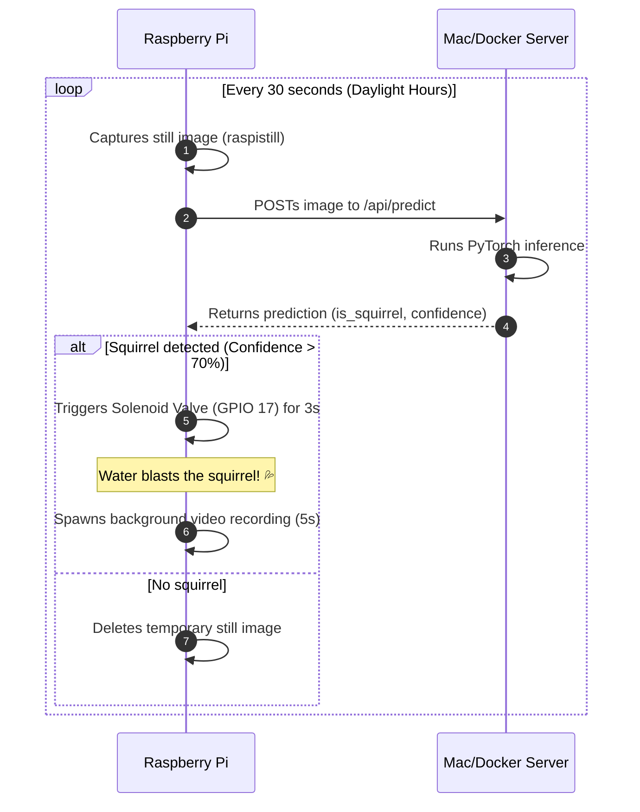

# Squirrel Soaker 9001 💦🐿️

The **Squirrel Soaker 9001** is an automated, AI-powered garden protection system designed to detect squirrels at a birdfeeder and gently repel them with a brief blast from a water solenoid valve. 

It splits the workload between:
1. **A Raspberry Pi 3/4** equipped with a camera module to capture photos in real-time, run local solenoid activations, and capture video recordings.
2. **A Mac server (or Docker container on Unraid/NAS)** running a PyTorch image classification model (finetuned ResNet-18) to analyze incoming photos in under 0.1 seconds and determine if a squirrel is present.

---

## Architecture Flow



---

## Hardware Requirements

1. **Raspberry Pi 3 or 4** (running Raspberry Pi OS).
2. **Raspberry Pi Camera Module** (configured with legacy camera stack support).
3. **12V Solenoid Valve** (normally closed).
4. **Relay Module or Transistor circuit** (to allow the Pi's 3.3V GPIO 17 pin to control the 12V solenoid).
5. **12V DC Power Supply** (to power the solenoid valve).
6. **Tubing and nozzle** (mounted near the birdfeeder).

---

## Deployment & Server Setup

The prediction backend server runs a Flask application that exposes the inference API and provides a review web UI to re-sort dataset images, watch spray event videos, and manage the system.

### Option A: Local Mac Server (Metal GPU Accelerated)
To train the model or run inference on Apple Silicon with hardware acceleration (MPS):

1. **Install Python dependencies**:
   ```bash
   python3 -m venv .venv
   source .venv/bin/activate
   pip install -r requirements.txt
   # Install PyTorch with MPS support
   pip install torch torchvision
   ```
2. **Train the Model**:
   Put your training images in `data/dataset/squirrel/` and `data/dataset/not_squirrel/`, then run:
   ```bash
   python train.py
   ```
3. **Start the Classifier App**:
   ```bash
   python classify_images.py
   ```

### Option B: Docker / Unraid Deployment
You can deploy the app inside a lightweight Docker container, ideal for running on an Unraid home server or a NAS.

1. **Docker Compose (Recommended)**:
   Spin up the container instantly using the provided `docker-compose.yml`:
   ```bash
   docker-compose up -d --build
   ```
2. **Unraid Manual Configuration**:
   - **Repository**: Build the image (`docker build -t squirrel-soaker:latest .`) or push it to a registry.
   - **Network Type**: `Bridge`
   - **Host Port**: Map `5001` to `5001`.
   - **Host Path (Volume Mount)**: Map `/app/data` to a persistent user share path (e.g. `/mnt/user/appdata/squirrel-soaker/data`). This is where raw uploads, reviews, and videos are saved.
   - **Model Path (Optional File Mount)**: Map `/app/model.pth` to your local `model.pth` to preserve weights across container upgrades.

---

## Raspberry Pi Setup

1. **Clone the project files** onto the Raspberry Pi at `~/squirrel_soaker/`.
2. **Install Python dependencies**:
   ```bash
   sudo apt-get install python3-pip
   pip3 install RPi.GPIO
   ```
3. **Configure Settings**:
   Edit `~/squirrel_soaker/capture.py` to specify your Mac/Docker server's IP address:
   ```python
   MAC_IP = '192.168.86.137'  # Replace with your Docker/Mac host IP
   ```
4. **Deploy Systemd Services**:
   Enable the scripts to run automatically on boot and restart if they crash:
   ```bash
   # Copy services files
   sudo cp ~/squirrel_soaker/squirrel-trigger.service /etc/systemd/system/
   sudo cp ~/squirrel_soaker/squirrel-capture.service /etc/systemd/system/
   
   # Reload systemd and enable services
   sudo systemctl daemon-reload
   sudo systemctl enable squirrel-trigger.service
   sudo systemctl enable squirrel-capture.service
   
   # Start services
   sudo systemctl start squirrel-trigger.service
   sudo systemctl start squirrel-capture.service
   ```
5. **Monitor Logs**:
   ```bash
   # Check camera capture and prediction logs
   journalctl -u squirrel-capture.service -f
   
   # Check solenoid triggers and video recording logs
   journalctl -u squirrel-trigger.service -f
   ```

---

## Web UI Controls & Keyboard Shortcuts

Access the web interface at **`http://<server-ip>:5001`**.

* **Automation Toggle**: Click the **Automation: Active 🟢** / **Automation: Paused 🔴** button in the header actions to temporarily pause automated spraying. When paused, the system will still log captures and auto-classify images, but will not trigger the solenoid spray.
* **Review Modes**: Switch between reviewing unclassified captures, sorting squirrel/not-squirrel image cards, reviewing spray videos, or retraining the model.
* **Model Training**: Select **Train Model 🧠** in the sidebar to trigger retraining on your custom dataset. The UI streams the training process output logs in real-time, and the server dynamically hot-reloads the new weights on completion.
* **Undo Stack**: Click **Undo ↩️** or press **`z`** / **`u`** to instantly undo any image movement.
* **Review Grid**: Hover cards to quick-reclassify. Click cards to open the fullscreen gallery modal.
* **Keyboard Shortcuts**:
  - `➔` (Right Arrow): Classify as Squirrel.
  - `◀` (Left Arrow): Classify as Not Squirrel.
  - `▼` (Down Arrow) / `Delete`: Move to Trash.
  - `[` and `]`: Navigate prev/next in the fullscreen preview modal.
  - `Spacebar`: Trigger a manual spray test.

---

## Credits & Attribution

This project is a refactored, production-ready implementation based on the original project described in the blog post:
* **[Squirrel Soaker 9000: Protecting the Birdfeeder with Artificial Intelligence](https://jeremybmerrill.com/blog/2022/01/squirrel-soaker-9000-repelling-squirrels-with-ai.html)** by **Jeremy B. Merrill**.

Special thanks to Jeremy for the wonderful hardware design and concept!

