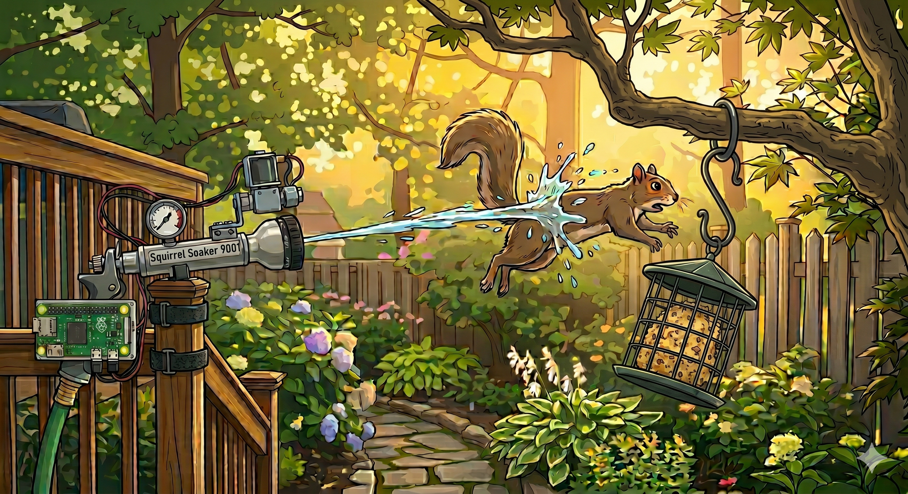
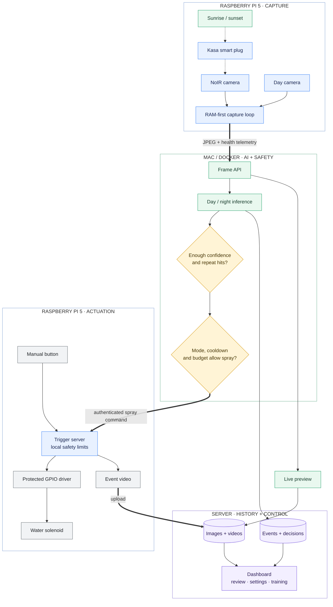

# Squirrel Soaker 9001



The **Squirrel Soaker 9001** is an automated, AI-powered garden protection system that detects squirrels at a birdfeeder and gently repels them with a short blast from a water solenoid valve.

The current `main` branch uses a Raspberry Pi 5 with Camera Module 3 for images and solenoid control:

1. **Raspberry Pi 5 with Camera Module 3**. The Pi captures still frames with `rpicam-still`, keeps normal frames in memory, sends them to the Mac app for inference, records spray videos with `rpicam-vid`, and controls the solenoid/button GPIO.
2. **Mac server or Docker host** running the Flask web app and PyTorch classifier. It receives Pi frames, runs inference, saves review frames, exposes the dashboard, and stores the training dataset.
3. **Optional IP-camera snapshot feed** remains available through Settings for camera-only experiments.

The current capture path uses Pi still images because they are cleaner for classification than RTSP video frames. Retired Pi 3 streaming, rsync, Wyze Bridge, and ESP32 deployment files have been removed from the active codebase.

---

## Architecture Flow


```mermaid
flowchart TB
    subgraph CAPTURE["RASPBERRY PI 5 · CAPTURE"]
        direction LR
        SUN["Sunrise / sunset"] -.-> PLUG["Kasa smart plug"] -.-> NIGHT["NoIR camera"]
        DAY["Day camera"] --> CAP["RAM-first capture loop"]
        NIGHT --> CAP
    end

    subgraph INTELLIGENCE["MAC / DOCKER · AI + SAFETY"]
        direction LR
        API["Frame API"] --> MODEL["Day / night inference"]
        MODEL --> DETECT{"Enough confidence<br/>and repeat hits?"}
        DETECT --> SAFE{"Mode, cooldown<br/>and budget allow spray?"}
    end

    subgraph ACTION["RASPBERRY PI 5 · ACTUATION"]
        direction LR
        BUTTON["Manual button"] --> TRIGGER["Trigger server<br/>local safety limits"]
        TRIGGER --> DRIVER["Protected GPIO driver"] --> VALVE["Water solenoid"]
        TRIGGER --> VIDEO["Event video"]
    end

    subgraph HISTORY["SERVER · HISTORY + CONTROL"]
        direction LR
        EVENTS[("Events + decisions")] --> UI["Dashboard<br/>review · settings · training"]
        MEDIA[("Images + videos")] --> UI
    end

    CAP == "JPEG + health telemetry" ==> API
    SAFE == "authenticated spray command" ==> TRIGGER
    API --> LIVE["Live preview"] --> MEDIA
    MODEL --> EVENTS
    VIDEO == "upload" ==> MEDIA

    classDef pi fill:#e8f1ff,stroke:#3b82f6,color:#172554
    classDef server fill:#e9f8ef,stroke:#22a06b,color:#153c2b
    classDef safety fill:#fff4d6,stroke:#d89b18,color:#4a3500
    classDef data fill:#f3efff,stroke:#7c5ce0,color:#2b1b5a
    classDef hardware fill:#f1f3f5,stroke:#687076,color:#202428
    class DAY,NIGHT,CAP,TRIGGER,PLUG pi
    class API,MODEL,LIVE,SUN server
    class DETECT,SAFE safety
    class EVENTS,MEDIA,UI data
    class BUTTON,VIDEO,DRIVER,VALVE hardware
    style CAPTURE fill:transparent,stroke:#8aa7d6,stroke-width:1px
    style INTELLIGENCE fill:transparent,stroke:#79b69a,stroke-width:1px
    style ACTION fill:transparent,stroke:#8aa7d6,stroke-width:1px
    style HISTORY fill:transparent,stroke:#9b8ad6,stroke-width:1px
```

Normal camera operation keeps media on the Mac/server:

- Still images are captured on the Pi and posted to the Mac app.
- Unsaved analysis frames are kept in memory only and dropped after inference.
- Review frames are saved on the Mac, not the Pi.
- Spray/detection history is stored as durable blast events; videos are media attachments, so deleting video files does not remove false-positive or accuracy history.

### Repository Layout

- `classify_images.py`: Flask application entry point and current web UI.
- `squirrel_soaker/`: shared settings, safety, health, Kasa, and training helpers.
- `pi/`: Raspberry Pi agents, deployment script, systemd templates, and hardware tools.
- `tools/`: server-side model training and optional Gemini labeling utilities.
- `tests/`: dependency-light unit tests used by CI.
- `docs/`: architecture, wiring, safety, troubleshooting, model, and project-story documentation.

### Day and NoIR Night Cameras

The Pi 5 can run two Camera Module 3 cameras at the same time: a normal camera
for daylight and a Camera Module 3 NoIR for darkness. The default camera
indexes are `0` for day and `1` for night. Confirm the indexes on the Pi before
configuring them:

```bash
rpicam-hello --list-cameras
```

At the configured sunrise/sunset boundary, the capture service automatically:

1. Selects the normal or NoIR camera index.
2. Tags the uploaded frame as `day` or `night`.
3. Runs the matching day or night model on the server.
4. Uses the active camera for any spray-event video recorded during that period.

The schedule can follow local sunrise and sunset using configurable latitude,
longitude, and offsets, or use fixed hours. Capture continues all night; the
schedule changes the active camera and model rather than putting the system to
sleep.

A NoIR camera removes the infrared-blocking filter, but it does not create
infrared light. Night operation therefore needs a separate IR illuminator or
another source of IR light. An 850 nm illuminator generally gives stronger
camera visibility with a faint red glow; 940 nm is less visible but usually
has less range. Avoid aiming IR through a window because reflections can wash
out the image.

The optional TP-Link/Kasa integration controls power to the night camera or
its IR illumination equipment. Enter the plug's fixed LAN IP and enable **IR
Camera Plug** in Settings. The server requests power on during the night period
and off during the day period. Camera-index switching works independently, so
leave plug control disabled when both cameras are powered directly by the Pi.

Use **Pi Diagnostics** to test the day and NoIR cameras separately before
enabling automation. Check framing, focus, exposure, and IR illumination in
actual darkness; daytime testing alone is not representative of the night
image. Camera Module 3 NoIR supports autofocus, but a case pressing on the lens
or restricting lens movement can still produce consistently blurry images.

---

## Hardware Requirements

1. Raspberry Pi 5 with a normal Camera Module 3 for daytime capture.
2. Camera Module 3 NoIR for nighttime capture, plus suitable IR illumination.
3. Optional TP-Link/Kasa smart plug for scheduled night-camera or illuminator power.
4. A Docker host running `squirrel-soaker`.
5. 12V normally closed solenoid valve.
6. Relay/transistor controller for the 12V solenoid.
7. Momentary push button wired to the Pi for manual sprays.
8. 12V DC power supply, garden hose, and a sprayer mounted near the birdfeeder.

---

## Server Setup

The server runs `classify_images.py`, a Flask app that provides:

- `/api/predict` for image inference.
- `/api/pi_status` and `/api/health/history` for system telemetry.
- `/api/settings` for camera source, snapshot URL, cadence, quality, and automation settings.
- `/api/upload_video` for spray event videos.
- A web UI for live monitoring, image review, video review, training, settings, and calibration.

### Option A: Local Mac Server

Use this path for local development or Apple Silicon training.

```bash
python3 -m venv .venv
source .venv/bin/activate
pip install -r requirements.txt
pip install torch torchvision
python classify_images.py
```

To train the classifier, put images in:

- `data/dataset/squirrel/`
- `data/dataset/not_squirrel/`

For camera-specific training, use the same class folders under:

- `data/dataset_day/`
- `data/dataset_night/`

Then run:

```bash
python -m tools.train
```

Train the two camera periods independently with:

```bash
python -m tools.train --period day
python -m tools.train --period night
```

The Training view exposes the same period selector. After training, choose
whether the timestamped checkpoint becomes the day model, night model, or both.
New checkpoint names identify their dataset, such as
`resnet18_day_YYYYMMDD_HHMMSS.pth`, `resnet18_night_YYYYMMDD_HHMMSS.pth`,
or `resnet18_shared_YYYYMMDD_HHMMSS.pth`.
If a period-specific dataset directory does not exist, training falls back to
the shared `data/dataset/` directory.

Model weights are intentionally not included in this repository. Each
installation must train its own classifier from its own camera and feeder
data. Docker training promotes timestamped checkpoints into the persistent
`data/models/` directory. Model files are ignored by Git.

### Option B: Docker

Docker is the normal deployment path for the Mac/server app.

```bash
docker compose up -d --build
```

The included `docker-compose.yml` maps:

- `5001:5001` for the web app.
- `./data:/app/data` for persistent images, videos, labels, settings, SQLite data, and locally trained checkpoints under `data/models/`.
- `PI_IP=<pi-address>` so manual web sprays can call the Pi 5 trigger server.
- `CAMERA_SOURCE=pi` so the Mac app waits for Pi uploads instead of polling an IP-camera snapshot bridge.
- `PUBLIC_BASE_URL=http://<server-address>:5001` so notification links use the reachable server address instead of Docker's internal bridge IP.

---

## Raspberry Pi 5 Setup

The Pi-side scripts and services are:

- `pi/capture.py`: still capture, motion prefilter, inference upload, and Pi status reporting.
- `pi/trigger_server.py`: local solenoid HTTP endpoint, spray video recording, and backlog sync.
- `pi/pi_benchmark.py`: camera/preprocessing benchmark used by Diagnostics.
- `pi/systemd/`: capture and trigger service templates.
- `pi/deploy.sh`: copies Pi agents and shared modules, renders services, and restarts them.

On a freshly flashed Raspberry Pi OS install, install the small Python dependency used for motion scoring. Current Raspberry Pi OS on Pi 5 should already include `rpicam-apps`, `gpiozero`, and `lgpio`; install them if missing:

```bash
sudo apt-get update
sudo apt-get install -y python3-pil python3-gpiozero python3-lgpio rpicam-apps
```

Current Raspberry Pi OS uses `rpicam-still` and `rpicam-vid`. The Pi scripts auto-detect those tools first, then fall back to `libcamera-*` or legacy `raspistill`/`raspivid` if present.

With both cameras connected, verify that Raspberry Pi OS detects each one and
note the index assigned to the normal and NoIR modules:

```bash
rpicam-hello --list-cameras
```

The defaults expect the day camera at index `0` and NoIR camera at index `1`.
Change **Day Camera Index** and **Night Camera Index** in Settings if the order
is reversed.

### Configure Host IP

The Pi scripts need the Mac/Docker host IP:

```bash
MAC_IP=<server-address>
```

Set that value in `.env`; `pi/deploy.sh` writes it to the private Pi
`device.env` file alongside the device token.

### Deploy to the Pi

From the Mac workspace:

```bash
./pi/deploy.sh
```

The deploy script copies the Pi files to the `pi5` SSH host at
`/home/<user>/squirrel_soaker` by default, installs the systemd services,
enables the capture and trigger services, and restarts them.

Override the target if needed:

```bash
PI_HOST=<ssh-host> PI_APP_DIR=/home/<user>/squirrel_soaker ./pi/deploy.sh
```

## Project Documentation

- `docs/ARCHITECTURE.md`: services, data flow, and recovery boundaries.
- `docs/WIRING.md` and `docs/SAFETY.md`: hardware bring-up and spray safety.
- `docs/TROUBLESHOOTING.md`: common server, Pi, camera, and video failures.
- `docs/MODEL_CARD.md` and `docs/RELEASING.md`: model provenance and release policy.
- `docs/BLOG_POST.md`: the project's development story.
- `CONTRIBUTING.md`, `SECURITY.md`, and `CODE_OF_CONDUCT.md`: community standards.

### Monitor Pi Logs

```bash
ssh pi5 'sudo journalctl -u squirrel-capture.service -f'
ssh pi5 'sudo journalctl -u squirrel-trigger.service -f'
```

Useful signs in the capture log:

- `Capturing to memory`: still frames are not being written to the Pi SD card.
- `No local image cleanup needed; frame stayed in memory`: normal successful upload path.
- `motion_skipped`: motion prefilter avoided inference/upload.
- `sd_write: false` in health telemetry: normal no-SD-write operation.
- `Pruned ... old backlog files`: the Pi removed oldest fallback files to protect SD-card space.

The trigger server also exposes Pi diagnostics through the Mac app. Use the web UI's **Pi Diagnostics** view to inspect GPIO state, camera command availability, CPU temperature, throttling, SD-card usage, `/dev/shm` usage, and backlog size. The same view can test still capture, record a short no-spray video, sync the SD backlog, and run the Pi benchmark. Relay pulse testing is available there but guarded by an explicit confirmation.

Manual hardware spray button:

- Default button pin is BCM GPIO 27, which is physical header pin 13, using the Pi's internal pull-up resistor.
- Wire one side of a normally open momentary button to physical pin 13 / BCM GPIO 27 and the other side to a Pi ground pin.
- Pressing the button should pull GPIO 27 from high to low and triggers the same local spray/video path as the web UI.
- Set `BUTTON_PIN=<BCM pin>` in `pi/systemd/squirrel-trigger.service` if you need a different pin. Set `BUTTON_ACTIVE_LOW=false` for active-high button modules.

---

## Settings

Most runtime behavior is managed from the web UI Settings view.

Important settings:

- **Camera Source**: `pi` for the current Raspberry Pi 5 upload path. Legacy snapshot/RTSP fields are hidden behind the advanced camera-source toggle.
- **Snapshot URL**: optional IP-camera snapshot URL if Camera Source is switched back to `snapshot`.
- **Analysis Interval**: how often the app fetches and analyzes a frame. Current default is 5 seconds.
- **Save Interval**: how often review images are saved for later classification. Current default is 30 seconds, though local settings may override this.
- **Live vs Review Size**: live analysis frames stay smaller for speed, while saved review/classification frames can use a higher Camera Module 3 resolution. The Pi 5 default is 2304x1296 review frames.
- **Sensor Mode**: default `2304:1296:10:P`, forcing live and review captures through the same Camera Module 3 sensor mode so ROI/crop stays aligned across 5-second live frames and 30-second review frames.
- **Day/NoIR Still ROI**: each camera has its own normalized `x,y,width,height` crop, so differently mounted cameras can frame the same feeder area.
- **Day/NoIR Video ROI**: each camera also has an independent spray-video crop. The active period's video ROI follows manual, confirmed, and automatic sprays.
- **Focus Mode**: Camera Module 3 focus is explicit. The current setup uses auto-on-capture by default; a full-frame diagnostic picked a lens position near `1.1`. Manual focus is available in Settings, but a bad manual value can make every frame look dramatically blurry.
- **Camera/Video Rotation**: still and video rotation are separate settings because Pi camera still and video paths can need different orientation values.
- **Camera Module 3 Tuning**: AWB, exposure, metering, saturation, contrast, and sharpness are configurable. Defaults are neutral for a normal Camera Module 3.
- **Daylight Schedule**: camera/model switching can use sunrise/sunset, defaulting to Reston, VA, or fixed start/end hours. Latitude, longitude, and sunrise/sunset offsets are configurable; capture continues during the night period.
- **Analysis Size and JPEG Quality**: smaller/faster transient frames.
- **Review JPEG Quality**: higher quality frames saved for classification.
- **Day/Night Camera Indexes**: select the normal Camera Module 3 for day frames and Camera Module 3 NoIR for night frames. Defaults are `0` and `1`.
- **Day/Night Models**: select independent model checkpoints because NoIR contrast, color, noise, and illumination differ substantially from daytime images.
- **IR Camera Plug**: optionally enable TP-Link/Kasa local control and enter the plug's LAN IP. The app turns it on during the night period and off during the day period. Leave it disabled unless the NoIR camera or IR illuminator is powered through that plug.
- **Camera Rotation**: legacy Pi camera rotation.
- **Confidence Threshold**: minimum squirrel confidence required before spraying.
- **Spray Decision Gate**: separates detection from spraying by requiring repeated qualifying detections inside a configurable time window.
- **Spray Mode**: automation can spray immediately after the decision gate passes, or ask for confirmation first. Confirmation mode sends a notification link to the dashboard with the live image plus spray/dismiss buttons.
- **Motion Prefilter**: skips inference when frame-to-frame motion is below the threshold, with a force-analysis interval to avoid going silent forever.

Camera calibration lives in the Settings view. Select **Day camera** or **NoIR
camera** above the ROI map to preview that camera's still crop. The latest image
remains the output from whichever camera is currently active; use Pi Diagnostics
to take an immediate test image from either camera after changing its ROI.

---

## Web UI

Access the web interface at:

```text
http://<server-ip>:5001
```

Main views:

- **Dashboard**: live snapshot, spray activity, queue stats, model accuracy, current health stats, and health graph over time.
- **Classify Queue**: sort raw captures into squirrel, not-squirrel, or trash.
- **Dataset Review**: inspect and correct labeled training images.
- **Videos**: review spray recordings, mark favorites, and play daily or all-time favorites compilations.
- **Training**: retrain the model, save a timestamped checkpoint, and choose whether to activate it.
- **Settings**: configure camera cadence, image quality, ROI calibration, thresholds, motion prefilter, and automation behavior.

When a spray video is marked as a false positive, the app extracts several frames into `data/dataset/not_squirrel` as hard-negative examples. Starting training also backfills hard negatives from all currently marked false-positive videos before launching `tools.train`.

Successful UI training writes `model.pth` and also copies it to a period-labeled timestamped checkpoint under `data/models/`. The Train page prompts before switching `active_model` to the newly trained checkpoint.

Dashboard health charts:

- **Latency**: capture, upload, model, and end-to-end Pi loop time.
- **Freshness & Motion**: last analyzed frame age and motion score.
- **Pi Resources**: CPU temperature, SD card use, and SD backlog files.

---

## Keyboard Shortcuts

- `Right Arrow`: classify as squirrel.
- `Left Arrow`: classify as not squirrel.
- `Down Arrow` or `Delete`: move to trash.
- `[` and `]`: previous/next in preview modal.
- `z` or `u`: undo the last image movement.
- `Spacebar`: trigger a manual spray test.

---

## Operations Notes

- The Pi is intentionally RAM-first to reduce SD-card wear.
- `~/squirrel_soaker/captures` on the Pi is a legacy backlog directory, not the normal storage location.
- Spray videos are recorded in `/dev/shm/squirrel_soaker` and removed from the Pi after a successful upload.
- If the Mac app is down during a save/upload, the Pi writes only the failed file to the SD backlog, prunes that backlog by age/size/count, and syncs it back when the Mac is reachable.
- Server-side persistent data lives under `data/`.
- Live snapshots update from the latest analyzed Pi-upload frame.
- If the live view slows down, check the health graph first. Snapshot fetch time and model time are the main signals.

---

## Credits & Attribution

This project is based on the original project described in:

**[Squirrel Soaker 9000: Protecting the Birdfeeder with Artificial Intelligence](https://jeremybmerrill.com/blog/2022/01/squirrel-soaker-9000-repelling-squirrels-with-ai.html)** by **Jeremy B. Merrill**.

Special thanks to Jeremy for the hardware design and concept.
