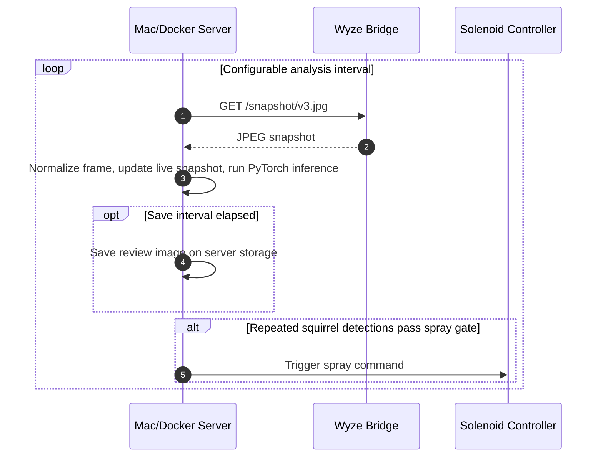

# Squirrel Soaker 9001

The **Squirrel Soaker 9001** is an automated, AI-powered garden protection system that detects squirrels at a birdfeeder and gently repels them with a short blast from a water solenoid valve.

The current `main` branch uses a Wyze/IP-camera snapshot feed for images:

1. **Wyze Cam v3 through docker-wyze-bridge**. The bridge exposes a local JPEG snapshot at `http://localhost:5050/snapshot/v3.jpg` on the Mac host, and at `http://wyze-bridge:5000/snapshot/v3.jpg` from inside Docker.
2. **Mac server or Docker host** running the Flask web app and PyTorch classifier. It pulls snapshots on the analysis interval, runs inference, saves review frames, exposes the dashboard, and stores the training dataset.
3. **Raspberry Pi / future ESP32 solenoid controller** for water control. The legacy Pi camera/capture implementation is preserved on the `pi-camera-legacy` branch.

The current capture path uses HTTP JPEG snapshots because still frames are cleaner for classification than RTSP video frames.

---

## Architecture Flow


```mermaid
sequenceDiagram
    autonumber
    loop Configurable analysis interval
        Mac/Docker Server->>Wyze Bridge: GET /snapshot/v3.jpg
        Wyze Bridge-->>Mac/Docker Server: JPEG snapshot
        Mac/Docker Server->>Mac/Docker Server: Normalize frame, update live snapshot, run PyTorch inference
        opt Save interval elapsed
            Mac/Docker Server->>Mac/Docker Server: Save review image on server storage
        end
        alt Repeated squirrel detections pass spray gate
            Mac/Docker Server->>Solenoid Controller: Trigger spray command
        end
    end
```

Normal camera operation keeps media on the Mac/server:

- Still images are fetched from the configured snapshot URL.
- Unsaved analysis frames are kept in memory only and dropped after inference.
- Review frames are saved on the Mac, not the Pi.
- Spray/detection history is stored as durable blast events; videos are media attachments, so deleting video files does not remove false-positive or accuracy history.

---

## Hardware Requirements

1. Wyze Cam v3 or another IP camera with a local JPEG snapshot URL.
2. Docker Desktop on the Mac/server, running `squirrel-soaker` and `wyze-bridge`.
3. 12V normally closed solenoid valve.
4. Relay/transistor controller for the 12V solenoid. The previous Pi GPIO controller still works from the `pi-camera-legacy` branch; an ESP32 controller is a good future replacement.
5. Momentary push button wired to the controller for manual sprays.
6. 12V DC power supply for the solenoid valve.
7. Tubing and nozzle mounted near the birdfeeder.

---

## Server Setup

The server runs `classify_images.py`, a Flask app that provides:

- `/api/predict` for image inference.
- `/api/pi_status` and `/api/health/history` for system telemetry.
- `/api/settings` for camera source, snapshot URL, cadence, quality, and automation settings.
- `/api/upload_video` for spray event videos.
- A web UI for live monitoring, image review, video review, training, settings, and calibration.

### Option A: Local Mac Server

Use this path for local development or Apple Silicon training.

```bash
python3 -m venv .venv
source .venv/bin/activate
pip install -r requirements.txt
pip install torch torchvision
python classify_images.py
```

To train the classifier, put images in:

- `data/dataset/squirrel/`
- `data/dataset/not_squirrel/`

Then run:

```bash
python train.py
```

### Option B: Docker

Docker is the normal deployment path for the Mac/server app.

```bash
docker compose up -d --build
```

The included `docker-compose.yml` maps:

- `5001:5001` for the web app.
- `5050:5000`, `8554:8554`, and `8888:8888` for docker-wyze-bridge.
- `./data:/app/data` for persistent images, videos, labels, settings, and SQLite data.
- `./model.pth:/app/model.pth` for persistent model weights.
- `SNAPSHOT_URL=http://wyze-bridge:5000/snapshot/v3.jpg` so the app can fetch Wyze snapshots from inside Docker.
- `PUBLIC_BASE_URL=http://192.168.86.137` so notification links use the LAN address instead of Docker's internal bridge IP.

The Wyze bridge token cache is stored in the Docker volume `squirrel-soaker-codex_wyze-bridge-tokens`.

---

## Legacy Raspberry Pi Setup

The old Pi camera/capture path is preserved on the `pi-camera-legacy` branch. The repo still includes Pi-side scripts and services:

- `capture.py`: still capture, motion prefilter, inference upload, Pi status reporting.
- `trigger_server.py`: local solenoid HTTP endpoint, spray video recording, backlog sync.
- `squirrel-capture.service`: runs the capture loop.
- `squirrel-trigger.service`: runs the local trigger server.
- `deploy_pi.sh`: copies Pi scripts/services and restarts the services.

On a freshly flashed Raspberry Pi OS install, install the small Python dependency used for motion scoring:

```bash
sudo apt-get update
sudo apt-get install -y python3-pil
```

Current Raspberry Pi OS uses `rpicam-still` and `rpicam-vid`. The Pi scripts auto-detect those tools first, then fall back to `libcamera-*` or legacy `raspistill`/`raspivid` if present.

### Configure Host IP

The Pi scripts need the Mac/Docker host IP:

```python
MAC_IP = '192.168.86.137'
```

Update that value in `capture.py` and `trigger_server.py` if the server host changes.

### Deploy to the Pi

From the Mac workspace:

```bash
./deploy_pi.sh
```

The deploy script copies the Pi files to `pi@192.168.86.136:/home/pi/squirrel_soaker` by default, installs the systemd services, enables capture and trigger services, disables the old stream service, and restarts everything.

Override the target if needed:

```bash
PI_HOST=pi@<pi-ip> ./deploy_pi.sh
```

### Monitor Pi Logs

```bash
ssh pi@192.168.86.136 'sudo journalctl -u squirrel-capture.service -f'
ssh pi@192.168.86.136 'sudo journalctl -u squirrel-trigger.service -f'
```

Useful signs in the capture log:

- `Capturing to memory`: still frames are not being written to the Pi SD card.
- `No local image cleanup needed; frame stayed in memory`: normal successful upload path.
- `motion_skipped`: motion prefilter avoided inference/upload.
- `sd_write: false` in health telemetry: normal no-SD-write operation.
- `Pruned ... old backlog files`: the Pi removed oldest fallback files to protect SD-card space.

Manual hardware spray button:

- Default button pin is BCM GPIO 27, which is physical header pin 13, using the Pi's internal pull-up resistor.
- Wire one side of a normally open momentary button to physical pin 13 / BCM GPIO 27 and the other side to a Pi ground pin.
- Pressing the button should pull GPIO 27 from high to low and triggers the same local spray/video path as the web UI.
- Set `BUTTON_PIN=<BCM pin>` in `squirrel-trigger.service` if you need a different pin. Set `BUTTON_ACTIVE_LOW=false` for active-high button modules.

---

## Settings

Most runtime behavior is managed from the web UI Settings view.

Important settings:

- **Camera Source**: `snapshot` for Wyze/IP-camera snapshots, `pi` for legacy Pi uploads, or `rtsp` for the old RTSP reader.
- **Snapshot URL**: default Docker URL is `http://wyze-bridge:5000/snapshot/v3.jpg`.
- **Analysis Interval**: how often the app fetches and analyzes a frame. Current default is 5 seconds.
- **Save Interval**: how often review images are saved for later classification. Current default is 30 seconds, though local settings may override this.
- **Daylight Schedule**: nighttime capture pause can use sunrise/sunset, defaulting to Reston, VA, or fixed start/end hours. Latitude, longitude, and sunrise/sunset offsets are configurable.
- **Analysis Size and JPEG Quality**: smaller/faster transient frames.
- **Review JPEG Quality**: higher quality frames saved for classification.
- **Camera ROI**: legacy Pi still-image crop.
- **Video ROI**: legacy Pi/video crop used for spray event videos.
- **Camera Rotation**: legacy Pi camera rotation.
- **Confidence Threshold**: minimum squirrel confidence required before spraying.
- **Spray Decision Gate**: separates detection from spraying by requiring repeated qualifying detections inside a configurable time window.
- **Motion Prefilter**: skips inference when frame-to-frame motion is below the threshold, with a force-analysis interval to avoid going silent forever.

Camera calibration lives in the Settings view. For snapshot cameras, the latest captured output is the important preview; the ROI map is mainly for the legacy Pi crop path.

---

## Web UI

Access the web interface at:

```text
http://<server-ip>:5001
```

Main views:

- **Dashboard**: live snapshot, spray activity, queue stats, model accuracy, current health stats, and health graph over time.
- **Classify Queue**: sort raw captures into squirrel, not-squirrel, or trash.
- **Dataset Review**: inspect and correct labeled training images.
- **Videos**: review spray event recordings.
- **Training**: retrain the model and hot-reload weights when training completes.
- **Settings**: configure camera cadence, image quality, ROI calibration, thresholds, motion prefilter, and automation behavior.

When a spray video is marked as a false positive, the app extracts several frames into `data/dataset/not_squirrel` as hard-negative examples. Starting training also backfills hard negatives from all currently marked false-positive videos before launching `train.py`.

Dashboard health graph:

- **Pi Loop**: full Pi capture/analyze loop time.
- **Upload**: Pi-to-server request time.
- **Predict**: server-side prediction request handling time.
- **Model**: raw model inference time.
- **Motion**: frame-to-frame motion score on the secondary axis.
- **Frame Age**: seconds since the Mac app last received an analyzed frame.

---

## Keyboard Shortcuts

- `Right Arrow`: classify as squirrel.
- `Left Arrow`: classify as not squirrel.
- `Down Arrow` or `Delete`: move to trash.
- `[` and `]`: previous/next in preview modal.
- `z` or `u`: undo the last image movement.
- `Spacebar`: trigger a manual spray test.

---

## Operations Notes

- The Pi is intentionally RAM-first to reduce SD-card wear.
- `~/squirrel_soaker/captures` on the Pi is a legacy backlog directory, not the normal storage location.
- Server-side persistent data lives under `data/`.
- Live snapshots update from the latest analyzed Wyze/IP-camera snapshot frame.
- If the live view slows down, check the health graph first. Snapshot fetch time and model time are the main signals.

---

## Credits & Attribution

This project is based on the original project described in:

**[Squirrel Soaker 9000: Protecting the Birdfeeder with Artificial Intelligence](https://jeremybmerrill.com/blog/2022/01/squirrel-soaker-9000-repelling-squirrels-with-ai.html)** by **Jeremy B. Merrill**.

Special thanks to Jeremy for the hardware design and concept.
