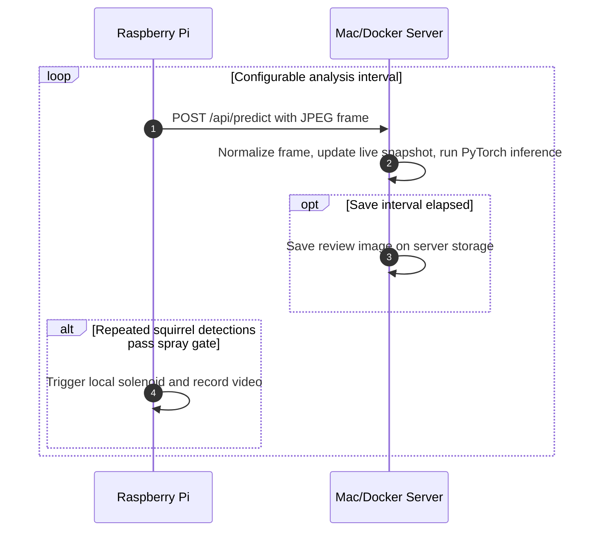

# Squirrel Soaker 9001

The **Squirrel Soaker 9001** is an automated, AI-powered garden protection system that detects squirrels at a birdfeeder and gently repels them with a short blast from a water solenoid valve.

The current `main` branch uses a Raspberry Pi 5 with Camera Module 3 for images and solenoid control:

1. **Raspberry Pi 5 with Camera Module 3**. The Pi captures still frames with `rpicam-still`, keeps normal frames in memory, sends them to the Mac app for inference, records spray videos with `rpicam-vid`, and controls the solenoid/button GPIO.
2. **Mac server or Docker host** running the Flask web app and PyTorch classifier. It receives Pi frames, runs inference, saves review frames, exposes the dashboard, and stores the training dataset.
3. **Optional Wyze/IP-camera snapshot feed** remains available through Settings for camera-only experiments.

The current capture path uses Pi still images because they are cleaner for classification than RTSP video frames and avoid depending on the dead Pi 3 or ESP32.

---

## Architecture Flow


```mermaid
sequenceDiagram
    autonumber
    loop Configurable analysis interval
        Raspberry Pi->>Mac/Docker Server: POST /api/predict with JPEG frame
        Mac/Docker Server->>Mac/Docker Server: Normalize frame, update live snapshot, run PyTorch inference
        opt Save interval elapsed
            Mac/Docker Server->>Mac/Docker Server: Save review image on server storage
        end
        alt Repeated squirrel detections pass spray gate
            Raspberry Pi->>Raspberry Pi: Trigger local solenoid and record video
        end
    end
```

Normal camera operation keeps media on the Mac/server:

- Still images are captured on the Pi and posted to the Mac app.
- Unsaved analysis frames are kept in memory only and dropped after inference.
- Review frames are saved on the Mac, not the Pi.
- Spray/detection history is stored as durable blast events; videos are media attachments, so deleting video files does not remove false-positive or accuracy history.

---

## Hardware Requirements

1. Raspberry Pi 5 with Camera Module 3.
2. Docker Desktop on the Mac/server, running `squirrel-soaker`.
3. 12V normally closed solenoid valve.
4. Relay/transistor controller for the 12V solenoid. The previous Pi GPIO controller still works from the `pi-camera-legacy` branch.
5. Momentary push button wired to the controller for manual sprays.
6. 12V DC power supply for the solenoid valve.
7. Tubing and nozzle mounted near the birdfeeder.

---

## Server Setup

The server runs `classify_images.py`, a Flask app that provides:

- `/api/predict` for image inference.
- `/api/pi_status` and `/api/health/history` for system telemetry.
- `/api/settings` for camera source, snapshot URL, cadence, quality, and automation settings.
- `/api/upload_video` for spray event videos.
- A web UI for live monitoring, image review, video review, training, settings, and calibration.

### Option A: Local Mac Server

Use this path for local development or Apple Silicon training.

```bash
python3 -m venv .venv
source .venv/bin/activate
pip install -r requirements.txt
pip install torch torchvision
python classify_images.py
```

To train the classifier, put images in:

- `data/dataset/squirrel/`
- `data/dataset/not_squirrel/`

Then run:

```bash
python train.py
```

### Option B: Docker

Docker is the normal deployment path for the Mac/server app.

```bash
docker compose up -d --build
```

The included `docker-compose.yml` maps:

- `5001:5001` for the web app.
- `./data:/app/data` for persistent images, videos, labels, settings, and SQLite data.
- `./model.pth:/app/model.pth` for persistent model weights.
- `PI_IP=192.168.86.107` so manual web sprays can call the Pi 5 trigger server.
- `CAMERA_SOURCE=pi` so the Mac app waits for Pi uploads instead of polling the Wyze snapshot bridge.
- `SPRAY_CONTROLLER_TYPE=pi` so manual web sprays use the Pi 5, not the ESP32.
- `PUBLIC_BASE_URL=http://192.168.86.137` so notification links use the LAN address instead of Docker's internal bridge IP.

---

## Optional ESP32 Solenoid Controller

The previous ESP-WROOM-32 ESPHome controller is preserved in `esphome/squirrel-soaker-controller.yaml`, but it is not used by the current Pi 5 deployment.

Default wiring:

- Relay control: GPIO26.
- Manual spray button: GPIO27, normally open to ground, using the ESP32 internal pull-up.
- The ESP32 GPIO should drive a relay module or transistor/MOSFET driver, not the solenoid directly. A bare coil needs proper flyback protection.

Create the private ESPHome secrets file before flashing:

```bash
cp esphome/secrets.example.yaml esphome/secrets.yaml
```

Then edit `esphome/secrets.yaml` with the Wi-Fi network name, Wi-Fi password, and fallback setup AP password. This file is ignored by git.

Flash over USB:

```bash
esphome run esphome/squirrel-soaker-controller.yaml --device /dev/cu.usbserial-0001
```

If you switch Settings back to ESPHome, the app triggers sprays through the ESPHome local web API:

```text
POST http://192.168.86.136/number/spray_duration/set?value=3.0
POST http://192.168.86.136/button/spray/press
```

The same controller can also be managed from the ESPHome native API if you later add Home Assistant or another ESPHome client.

---

## Raspberry Pi 5 Setup

The Pi-side scripts and services are:

- `capture.py`: still capture, motion prefilter, inference upload, Pi status reporting.
- `trigger_server.py`: local solenoid HTTP endpoint, spray video recording, backlog sync.
- `pi_benchmark.py`: Pi-side camera/preprocessing benchmark used by the Diagnostics view.
- `squirrel-capture.service`: runs the capture loop.
- `squirrel-trigger.service`: runs the local trigger server.
- `deploy_pi.sh`: copies Pi scripts/services and restarts the services.

On a freshly flashed Raspberry Pi OS install, install the small Python dependency used for motion scoring. Current Raspberry Pi OS on Pi 5 should already include `rpicam-apps`, `gpiozero`, and `lgpio`; install them if missing:

```bash
sudo apt-get update
sudo apt-get install -y python3-pil python3-gpiozero python3-lgpio rpicam-apps
```

Current Raspberry Pi OS uses `rpicam-still` and `rpicam-vid`. The Pi scripts auto-detect those tools first, then fall back to `libcamera-*` or legacy `raspistill`/`raspivid` if present.

### Configure Host IP

The Pi scripts need the Mac/Docker host IP:

```python
MAC_IP = '192.168.86.137'
```

Update that value in `capture.py` and `trigger_server.py` if the server host changes.

### Deploy to the Pi

From the Mac workspace:

```bash
./deploy_pi.sh
```

The deploy script copies the Pi files to the `pi5` SSH host at `/home/nolan/squirrel_soaker` by default, installs the systemd services, enables capture and trigger services, disables the old stream service, and restarts everything.

Override the target if needed:

```bash
PI_HOST=<ssh-host> PI_APP_DIR=/home/<user>/squirrel_soaker ./deploy_pi.sh
```

### Monitor Pi Logs

```bash
ssh pi5 'sudo journalctl -u squirrel-capture.service -f'
ssh pi5 'sudo journalctl -u squirrel-trigger.service -f'
```

Useful signs in the capture log:

- `Capturing to memory`: still frames are not being written to the Pi SD card.
- `No local image cleanup needed; frame stayed in memory`: normal successful upload path.
- `motion_skipped`: motion prefilter avoided inference/upload.
- `sd_write: false` in health telemetry: normal no-SD-write operation.
- `Pruned ... old backlog files`: the Pi removed oldest fallback files to protect SD-card space.

The trigger server also exposes Pi diagnostics through the Mac app. Use the web UI's **Pi Diagnostics** view to inspect GPIO state, camera command availability, CPU temperature, throttling, SD-card usage, `/dev/shm` usage, and backlog size. The same view can test still capture, record a short no-spray video, sync the SD backlog, and run the Pi benchmark. Relay pulse testing is available there but guarded by an explicit confirmation.

Manual hardware spray button:

- Default button pin is BCM GPIO 27, which is physical header pin 13, using the Pi's internal pull-up resistor.
- Wire one side of a normally open momentary button to physical pin 13 / BCM GPIO 27 and the other side to a Pi ground pin.
- Pressing the button should pull GPIO 27 from high to low and triggers the same local spray/video path as the web UI.
- Set `BUTTON_PIN=<BCM pin>` in `squirrel-trigger.service` if you need a different pin. Set `BUTTON_ACTIVE_LOW=false` for active-high button modules.

---

## Settings

Most runtime behavior is managed from the web UI Settings view.

Important settings:

- **Camera Source**: `pi` for the current Raspberry Pi 5 upload path. Legacy snapshot/RTSP fields are hidden behind the advanced camera-source toggle.
- **Snapshot URL**: optional IP-camera/Wyze snapshot URL if Camera Source is switched back to `snapshot`.
- **Analysis Interval**: how often the app fetches and analyzes a frame. Current default is 5 seconds.
- **Save Interval**: how often review images are saved for later classification. Current default is 30 seconds, though local settings may override this.
- **Live vs Review Size**: live analysis frames stay smaller for speed, while saved review/classification frames can use a higher Camera Module 3 resolution. The Pi 5 default is 2304x1296 review frames.
- **Sensor Mode**: default `2304:1296:10:P`, forcing live and review captures through the same Camera Module 3 sensor mode so ROI/crop stays aligned across 5-second live frames and 30-second review frames.
- **Video ROI**: spray videos use their own ROI, but still use the same Camera Module 3 sensor mode as still captures so video and preview crops are comparable.
- **Focus Mode**: Camera Module 3 focus is explicit. The current setup uses auto-on-capture by default; a full-frame diagnostic picked a lens position near `1.1`. Manual focus is available in Settings, but a bad manual value can make every frame look dramatically blurry.
- **Camera/Video Rotation**: still and video rotation are separate settings because Pi camera still and video paths can need different orientation values.
- **Camera Module 3 Tuning**: AWB, exposure, metering, saturation, contrast, and sharpness are configurable. Defaults are neutral for a normal Camera Module 3.
- **Daylight Schedule**: nighttime capture pause can use sunrise/sunset, defaulting to Reston, VA, or fixed start/end hours. Latitude, longitude, and sunrise/sunset offsets are configurable.
- **Analysis Size and JPEG Quality**: smaller/faster transient frames.
- **Review JPEG Quality**: higher quality frames saved for classification.
- **Camera ROI**: legacy Pi still-image crop.
- **Video ROI**: legacy Pi/video crop used for spray event videos.
- **Camera Rotation**: legacy Pi camera rotation.
- **Confidence Threshold**: minimum squirrel confidence required before spraying.
- **Spray Decision Gate**: separates detection from spraying by requiring repeated qualifying detections inside a configurable time window.
- **Spray Controller**: use `Raspberry Pi` for the Pi 5 deployment. ESPHome remains available only if the ESP32 is put back in service.
- **Motion Prefilter**: skips inference when frame-to-frame motion is below the threshold, with a force-analysis interval to avoid going silent forever.

Camera calibration lives in the Settings view. For snapshot cameras, the latest captured output is the important preview; the ROI map is mainly for the legacy Pi crop path.

---

## Web UI

Access the web interface at:

```text
http://<server-ip>:5001
```

Main views:

- **Dashboard**: live snapshot, spray activity, queue stats, model accuracy, current health stats, and health graph over time.
- **Classify Queue**: sort raw captures into squirrel, not-squirrel, or trash.
- **Dataset Review**: inspect and correct labeled training images.
- **Videos**: review spray event recordings.
- **Training**: retrain the model and hot-reload weights when training completes.
- **Settings**: configure camera cadence, image quality, ROI calibration, thresholds, motion prefilter, and automation behavior.

When a spray video is marked as a false positive, the app extracts several frames into `data/dataset/not_squirrel` as hard-negative examples. Starting training also backfills hard negatives from all currently marked false-positive videos before launching `train.py`.

Dashboard health graph:

- **Pi Loop**: full Pi capture/analyze loop time.
- **Upload**: Pi-to-server request time.
- **Predict**: server-side prediction request handling time.
- **Model**: raw model inference time.
- **Motion**: frame-to-frame motion score on the secondary axis.
- **Frame Age**: seconds since the Mac app last received an analyzed frame.
- **CPU Temp**, **SD Used %**, and **SD Backlog**: Pi health signals that show heat, storage pressure, and whether fallback files are accumulating on the Pi SD card.

---

## Keyboard Shortcuts

- `Right Arrow`: classify as squirrel.
- `Left Arrow`: classify as not squirrel.
- `Down Arrow` or `Delete`: move to trash.
- `[` and `]`: previous/next in preview modal.
- `z` or `u`: undo the last image movement.
- `Spacebar`: trigger a manual spray test.

---

## Operations Notes

- The Pi is intentionally RAM-first to reduce SD-card wear.
- `~/squirrel_soaker/captures` on the Pi is a legacy backlog directory, not the normal storage location.
- Spray videos are recorded in `/dev/shm/squirrel_soaker` and removed from the Pi after a successful upload.
- If the Mac app is down during a save/upload, the Pi writes only the failed file to the SD backlog, prunes that backlog by age/size/count, and syncs it back when the Mac is reachable.
- Server-side persistent data lives under `data/`.
- Live snapshots update from the latest analyzed Pi-upload frame.
- If the live view slows down, check the health graph first. Snapshot fetch time and model time are the main signals.

---

## Credits & Attribution

This project is based on the original project described in:

**[Squirrel Soaker 9000: Protecting the Birdfeeder with Artificial Intelligence](https://jeremybmerrill.com/blog/2022/01/squirrel-soaker-9000-repelling-squirrels-with-ai.html)** by **Jeremy B. Merrill**.

Special thanks to Jeremy for the hardware design and concept.
