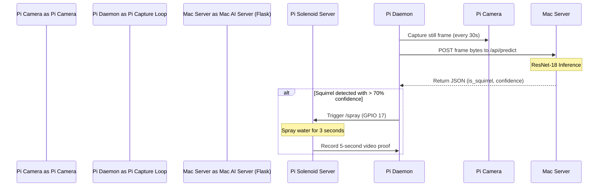

# Building the Squirrel Soaker 9001: An AI-Powered, Water-Blasting Feeder Sentry

Have you ever filled a bird feeder with premium seed, only to watch a horde of squirrels perform acrobatics, consume the entire supply in minutes, and scare away the local birds? 

Frustrated by this endless battle, I decided to stop relying on "squirrel-proof" feeders and build a high-tech solution: **The Squirrel Soaker 9001**. 

This project combines a **Raspberry Pi** edge node, a **PyTorch ResNet-18** deep learning model running on a local server, a **GPIO-controlled solenoid water valve**, and a **modern stats dashboard web app** to build the ultimate automated birdfeeder sentry.

Here is the complete engineering journey of how it was built.

---

## System Architecture Overview

The system is split into two nodes: the **Raspberry Pi Sentry** (mounted near the feeder) and the **Central Mac AI Server** (running locally in the house). 



### The Hardware Setup
- **Raspberry Pi 3/4**: Acts as the edge controller.
- **Pi Camera Module**: Positioned with a tight digital zoom (Region of Interest) focused on the feeder tray.
- **12V Solenoid Valve & Relay Module**: Plumbed into a garden hose, wired to GPIO 17 on the Pi.

---

## The Four Phases of Development

### Phase 1: Edge Capture & Data Sync
Before building an AI model, I needed data. I wrote a background daemon on the Raspberry Pi (`capture.py`) that captures still frames during daylight hours. 
A local shell script (`sync_images.sh`) runs in the background on the Mac, using `rsync` over SSH to pull the raw captured images from the Pi into a local `data/raw/` directory.

To sort this initial raw data into training folders (`squirrel` vs. `not_squirrel`), I built a custom **Flask Web Application** with an image review queue. I integrated keyboard shortcuts and a history-based **Undo Stack** so I could fly through hundreds of raw pictures and manually label them with high speed.

### Phase 2: Deep Learning with PyTorch
Once I collected about a thousand images, it was time to train the brain. 

I wrote `train.py` using **PyTorch** to fine-tune a pre-trained **ResNet-18** convolutional neural network. 

#### Addressing the Class Imbalance
My dataset had a classic class imbalance: **34 squirrel images** vs. **980 not-squirrel (birds/empty) images**. To prevent the model from simply guessing "not-squirrel" every time, I:
1. Implemented **Weighted Cross-Entropy Loss** to penalize misclassifications of the rare class more heavily.
2. Fine-tuned the *entire* network (rather than freezing the convolutional base) so the model could adapt its lower-level filters to the specific lighting, background, and zoom of my backyard bird feeder.

After 10 epochs, the model achieved **98.51% validation accuracy**, correctly identifying **91.2%** of the squirrels (with high confidence >70%) while maintaining near-zero false positives.

I integrated this model into the Mac Flask server at `/api/predict`. When the Pi captures a photo, it sends it here for inference. If the model is confident (>85%), it automatically moves the photo to the dataset folders, saving me manual sorting time!

### Phase 3: Containerization & Daemons
To make the system robust:
1. **Dockerized the Flask Server**: Created a lightweight `Dockerfile` using CPU-only PyTorch wheel downloads to keep the image footprint around 600MB. Configured a `docker-compose.yml` for easy hosting in Docker and Unraid.
2. **systemd Services on the Pi**: Created permanent system daemons (`squirrel-trigger.service` and `squirrel-capture.service`) with auto-restart properties to ensure the sentry loops reboot instantly if the Pi loses power or network connection.

---

## Phase 4: The Stats Dashboard

A high-tech sentry needs a command center. I updated the web app to feature a modern, dark-themed **Stats Dashboard** as the homepage, moving the manual classifier into a secondary view.

```
+--------------------------------------------------------------+
|  🐿️ Squirrel Soaker 9001                   [Automation: ON]  |
+--------------------------------------------------------------+
| View Mode:     |                                             |
| [Dashboard]    |  SYSTEM DASHBOARD 📊                        |
| [Classify]     |  +------------+ +------------+ +---------+  |
| [Videos]       |  | BLASTS: 12 | | LOOP: ACT  | | RAW: 2  |  |
|                |  +------------+ +------------+ +---------+  |
| Keyboard:      |                                             |
| space: spray   |  [ Blast Activity Graph ]  [ Live Feed ]    |
| z: undo        |  |   Auto vs. Manual    |  | Snapshot |    |
|                |  |   last 7 days        |  |  (15s)   |    |
+--------------------------------------------------------------+
```

### 📊 The 7-Day Activity Graph
Using **Chart.js**, the dashboard aggregates event data from a persistent `data/blasts_log.json` file. It displays a dual-bar chart representing water blasts over the last 7 days, color-coding auto-detections (green) and manual sprays (blue) side-by-side.

### 📹 Live Snapshot Feed (The lock-contention problem)
I wanted a live video feed on the dashboard, but hit an interesting engineering constraint: **device lock contention**. 

If I streamed continuous MJPEG/RTSP video from `/dev/video0` to the browser, the device handle would stay occupied. This blocked the background motion-detection script (`raspistill`) from grabbing frames, which disabled the AI.

**The Solution**: A "Live-ish" snapshot preview. I exposed a `/api/latest_image` route serving the newest JPEG across directories with cache-disabling headers. The dashboard polls this image every 15 seconds (matching the sync frequency) using a cache-busting timestamp (`?t=Date.now()`). 

To make it clear at a glance, I added a **dynamic status badge** inside the feed box:
- 🟢 `LIVE`: Green when active during daytime hours.
- 🟡 `SLEEPING (Night)`: Yellow when local time is outside configured shooting hours (8:00 PM to 6:00 AM), indicating the Pi camera loop is sleeping.
- 🔴 `IDLE / OFFLINE`: Red if it is daytime but no frames have synced for more than 5 minutes.

---

## Engineering Lessons Learned

1. **Beware of device locks on the edge**: Dedicated camera hardware like the Pi Camera module does not share access easily. Architecting around snapshot files rather than streams keeps edge daemons light and cooperative.
2. **Loss weighting is magic for small datasets**: When you only have 34 positive examples, standard neural nets will ignore them. Applying weights to the loss function forces the model to learn what a squirrel looks like.
3. **Detached training subprocesses**: Running PyTorch retraining inside Flask's main thread is a recipe for memory leaks and server crashes. Spawning it in a background process using the active interpreter and logging stdout to file keeps the UI snappy.

---

## Credits & Inspiration

This project was inspired by the original automated water blaster concept described in the blog post: *"How to build a Raspberry Pi-powered squirrel detector and water blaster"* (which set up the framework of motion sensing and solenoid relays). Building on top of that base with PyTorch training, Docker containers, and a full statistics dashboard took the concept to the next level.

The source code and configuration files are fully open-source and hosted on my GitHub!
