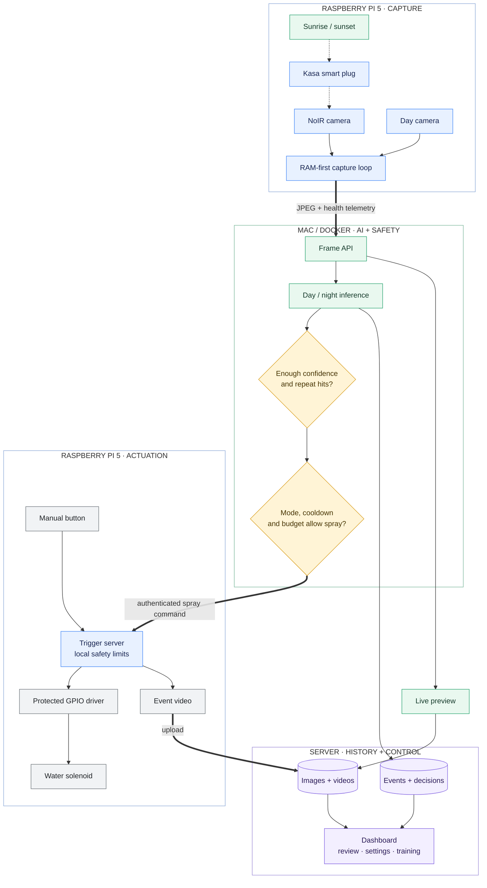

# Architecture

Squirrel Soaker has two cooperating processes:

The Pi is responsible for capture, local actuation, and short-lived video
buffers. The server owns inference, durable event history, training data, and
the web UI. Normal analysis frames stay in memory on the Pi and are sent to
the server; the Pi backlog is bounded so a disconnected server cannot fill
the SD card.

## Safety boundaries

- Pi commands require the configured device token.
- Spray duration, cooldown, daily budget, and confirmation mode are enforced
  before actuation.
- The trigger server performs local validation and has a manual emergency
  disable path.
- The IR plug is disabled by default and only changes state when its setting
  is enabled and the configured day/night period changes.

## Data flow and recovery

Events are separate from media attachments. Deleting a video does not erase
the event, classification history, or graph point. Failed uploads are retried
from the Pi's bounded backlog; the server remains the durable home for media.
See `docs/SAFETY.md` before connecting a new relay or solenoid.
